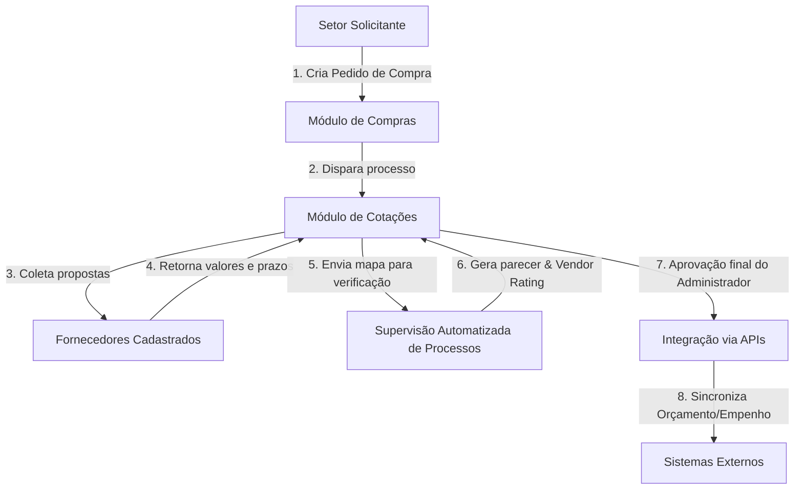

# 📐 Arquitetura & Fluxos Operacionais - CDC ADM

Este documento detalha a arquitetura lógica, os módulos do sistema e a **supervisão automatizada de processos** e a **integração via APIs** na operação do **CDC ADM**.

---

## 1. Fluxo de Compras e Cotações Automatizado

---

## 2. Componentes da Arquitetura

### A. Módulo de Fornecedores & Classificação (Vendor Rating)
- **Objetivo**: Manter cadastro unificado e atribuir notas (A, B, C, D) baseadas no cumprimento de contratos, prazos e conformidade fiscal.
- **Supervisão Automatizada**: O motor de regras analisa o histórico de entregas e gera parecer sintético de confiabilidade.

### B. Módulo de Compras e Requisições
- **Objetivo**: Controlar o ciclo de vida dos pedidos internos de materiais e serviços.

### C. Módulo de Cotações com Supervisão Automatizada
- **Objetivo**: Garantir que as cotações cumpram os requisitos formais de pesquisa de mercado.
- **Supervisão de Processos**: Identifica disparidades orçamentárias e previne contratações fora do preço praticado.

### D. Conector de APIs Externas
- **Objetivo**: Evitar reescrita manual de dados. Quando uma cotação é homologada, os lançamentos financeiros são transmitidos via APIs REST para os sistemas corporativos.

---

## 3. Segurança e Sanitização
- Tokens e credenciais das APIs são lidos estritamente de variáveis de ambiente.
- Nenhum dado sensível ou senha é enviado para o repositório Git.
